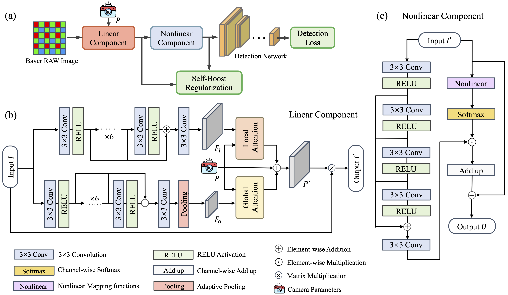

# Dark-ISP




## ⚙️ Dependencies and Installation:
Create the conda virtual environment with python version 3.8 and CUDA version 10.2
```bash
  conda create -n dark-isp python=3.8
  conda activate dark-isp
```
## 📦 Install the requirement
```bash
  cd mmdetection_github
  pip install -r requirements.txt 
```
### ⚠️ There are several libraries that require editable installation. All versions must be the same as those given. If some libraries update automatically during the installation process, they need to be uninstalled and reinstalled.
#### 1.mmcv
```bash
cd ../mmcv-2.1.0
pip install -v -e .
```
#### 2.mmengine
``` bash
cd ../mmengine-0.10.5
pip install -v -e .
```
#### 3.mmdet
```bash
cd ../mmdetection_github
pip install -v -e .
```
#### 4.LibRaw and rawpy
Unzip them:
```bash
cd ../downloads
unzip LibRaw-0.21.1.zip
unzip rawpy.zip
```
##### If you have `sudo` permission:
```bash
cd LibRaw-0.21.1
./configure
make
sudo make install
cd ../rawpy
RAWPY_USE_SYSTEM_LIBRAW=1 pip install -e .
```
##### Otherwise:
```
cd LibRaw-0.21.1
./configure --prefix=/path/to/your/directory 
make 
make install
```
Export environment variables:
```bash
export LD_LIBRARY_PATH=$LD_LIBRARY_PATH:/path/to/your/directory/lib/
export PKG_CONFIG_PATH=/path/to/your/directory/lib/pkgconfig:$PKG_CONFIG_PATH
```
Install rawpy:
```bash
cd ../rawpy
RAWPY_USE_SYSTEM_LIBRAW=1 pip install -e .
```
## 🗄 Data Peparation
We have uploaded the LOD dataset and orignal RAW images [here](https://pan.baidu.com/s/1234567890) (Extraction code：abcd).

To accelerate training, it is necessary to preprocess RAW format files into npz files. You need to replace the corresponding directory name in the code, then run it：
```python
python mmdetection_github/LOD_RAW_preprocess.py
```
The processed npz file was also uploaded to the cloud disk.
## 🤖 Training and Evaluation
```python
python mmdetection_github/tools/train.py mmdetection_github/configs/LOD/VOCmetric/R_Net_denoise_50.py
```
## 📷 Test
```python
python mmdetection_github/tools/test.py mmdetection_github/configs/LOD/VOCmetric/R_Net_denoise_50.py mmdetection_github/checkpoints/Daek-ISP_LOD_70.4.pth
```
